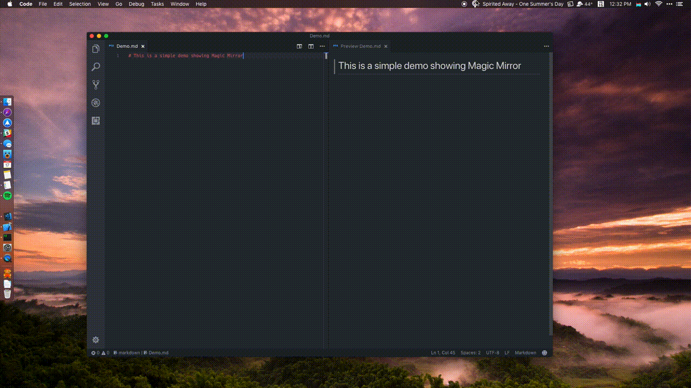
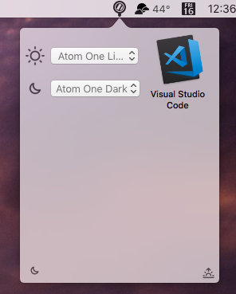
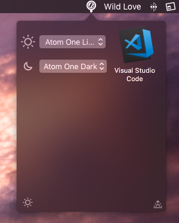

    

<h2 align="center">
  Magic Mirror
</h2>

    
    

**Magic Mirror** is a simple menu bar app that lets you easily switch between light and dark mode.

## Demo

## Screenshots

## Download

### [➡️ Click here to download the latest release ️⬅️ ](https://github.com/nehayward/Magic-Mirror/releases/download/v0.1/Magic.Mirror.zip)

## Supported Applications
- VSCode

## Road Map
- [ ] Open Source
- [ ] Add support for more apps (Sublime, Atom, Bear, XCode)
- [ ] Make new app integration easy.
- [ ] Write Unit Tests
- [ ] Add Core Data

### Compatibility

Magic Mirror is only available for OS X 10.13 or later.

